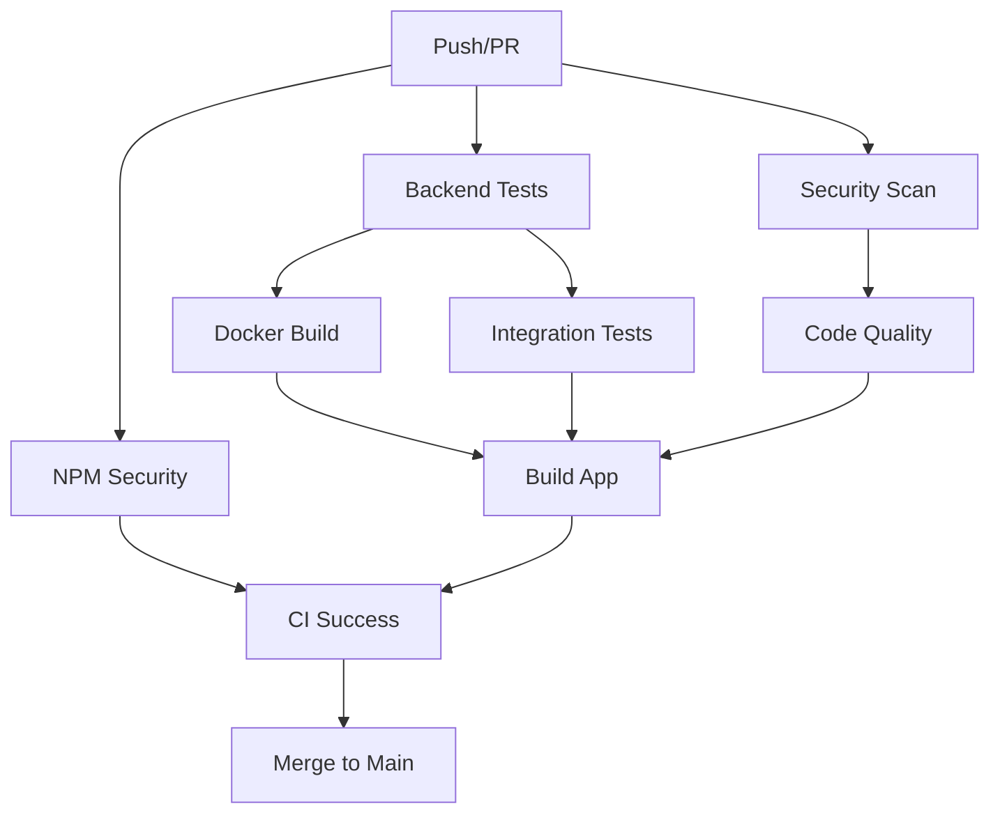

# Branch Protection Configuration

This document outlines the recommended branch protection settings for the Motion Detector repository.

## Main Branch Protection Settings

### Required Status Checks
The following status checks must pass before merging:

- **CI Success** - Final aggregated status check
- **Backend Tests (Python 3.9)** - Backend test suite on Python 3.9
- **Backend Tests (Python 3.10)** - Backend test suite on Python 3.10  
- **Backend Tests (Python 3.11)** - Backend test suite on Python 3.11
- **Security Scan** - Security vulnerability scanning
- **NPM Security Audit** - NPM dependency security audit
- **Docker Build Test** - Docker container build validation
- **Integration Tests** - API integration testing
- **Code Quality** - Linting and code formatting checks
- **Build Application** - Application build validation

### Branch Protection Rules

1. **Require pull request reviews before merging**: ✅
   - Required approving reviews: 1
   - Dismiss stale pull request approvals when new commits are pushed: ✅
   - Require review from code owners: ✅ (when CODEOWNERS file exists)

2. **Require status checks to pass before merging**: ✅
   - Require branches to be up to date before merging: ✅
   - Status checks that are required: All CI jobs listed above

3. **Require conversation resolution before merging**: ✅

4. **Require signed commits**: ⚠️ (Optional, recommended for production)

5. **Require linear history**: ✅
   - This enforces a clean Git history

6. **Include administrators**: ✅
   - Applies rules to repository administrators

7. **Allow force pushes**: ❌
   - Prevents force pushes to main branch

8. **Allow deletions**: ❌
   - Prevents branch deletion

## Setup Instructions

### Via GitHub Web Interface

1. Go to Repository Settings → Branches
2. Click "Add rule" for the main branch
3. Configure the settings as outlined above
4. Add all required status checks from the CI pipeline

### Via GitHub CLI

```bash
# Enable branch protection (requires admin access)
gh api repos/:owner/:repo/branches/main/protection \
  --method PUT \
  --field required_status_checks='{"strict":true,"contexts":["CI Success","Backend Tests (Python 3.9)","Backend Tests (Python 3.10)","Backend Tests (Python 3.11)","Security Scan","NPM Security Audit","Docker Build Test","Integration Tests","Code Quality","Build Application"]}' \
  --field enforce_admins=true \
  --field required_pull_request_reviews='{"required_approving_review_count":1,"dismiss_stale_reviews":true}' \
  --field restrictions=null
```

## Quality Gates Summary

### Automated Checks
- ✅ **Python 3.9, 3.10, 3.11 Testing** - Ensures compatibility across Python versions
- ✅ **Security Scanning** - Safety, Bandit, Semgrep, NPM audit
- ✅ **Code Quality** - Black formatting, isort imports, flake8 linting
- ✅ **Test Coverage** - 80% minimum coverage requirement
- ✅ **Docker Validation** - Container builds and runs successfully
- ✅ **Integration Testing** - End-to-end API validation

### Manual Review Process
- 👥 **Code Review** - At least 1 approving review required
- 💬 **Discussion Resolution** - All conversations must be resolved
- 📚 **Documentation** - Changes should include relevant documentation updates

## CI/CD Pipeline Overview



## Troubleshooting

### Common CI Failures

1. **Backend Tests Fail**
   - Check test logs for specific failures
   - Ensure virtual environment is properly activated
   - Verify dependencies in requirements.txt

2. **Security Scan Issues**
   - Update vulnerable dependencies
   - Review and address Bandit security warnings
   - Check for hardcoded secrets

3. **Code Quality Failures** 
   - Run `npm run format` to auto-fix formatting
   - Address flake8 linting issues manually
   - Ensure imports are properly sorted with isort

4. **Docker Build Failures**
   - Check Dockerfile syntax and dependencies
   - Ensure all required files are included in context
   - Verify base image availability

### Emergency Procedures

In case of urgent hotfixes:

1. Create hotfix branch from main
2. Make minimal necessary changes
3. Ensure all CI checks still pass
4. Get expedited review approval
5. Merge with all quality gates satisfied

**Note**: Never bypass branch protection for convenience - security and quality are paramount.