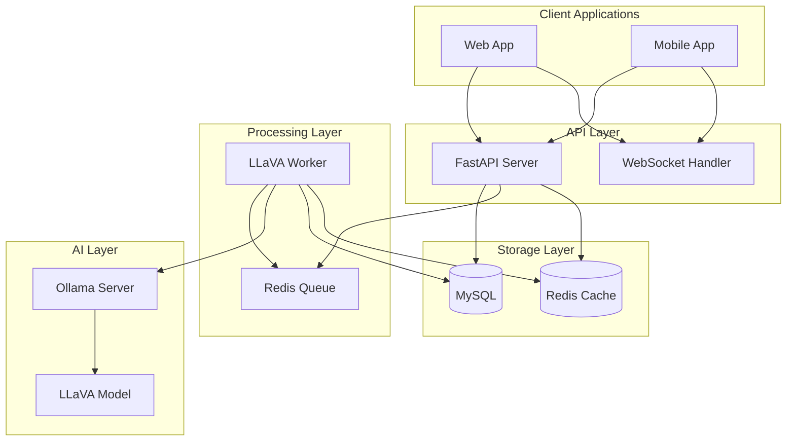
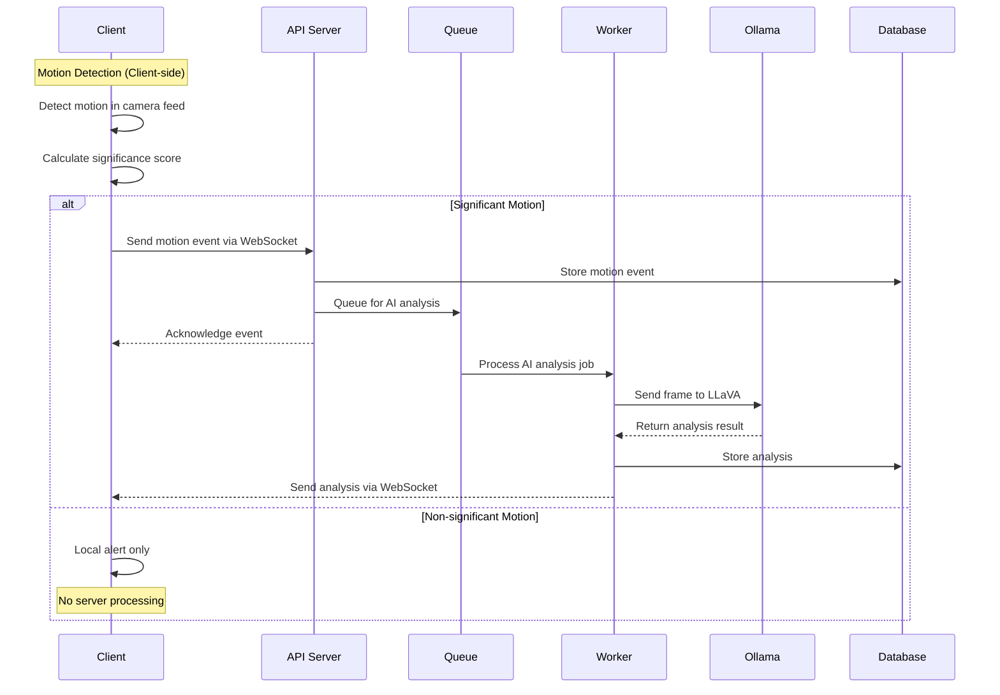

# Documentation - Development Guidelines

## Purpose

This directory contains all project documentation, API specifications, architectural decisions, and user guides for the Motion Detector platform.

## Documentation Structure

```
docs/
├── api/                 # API documentation
│   ├── openapi.yaml     # OpenAPI specification
│   ├── endpoints/       # Endpoint documentation
│   ├── websocket.md     # WebSocket API documentation
│   └── authentication.md # Auth documentation
├── architecture/        # System architecture
│   ├── overview.md      # High-level architecture
│   ├── data-flow.md     # Data flow diagrams
│   ├── components.md    # Component architecture
│   └── decisions/       # Architecture Decision Records
├── user-guides/         # User documentation
│   ├── getting-started.md # Quick start guide
│   ├── web-app.md       # Web application guide
│   ├── mobile-app.md    # Mobile application guide
│   └── troubleshooting.md # Common issues
├── development/         # Developer documentation
│   ├── setup.md         # Development environment setup
│   ├── contributing.md  # Contribution guidelines
│   ├── deployment.md    # Deployment procedures
│   └── testing.md       # Testing strategies
├── deployment/          # Deployment documentation
│   ├── docker.md        # Docker deployment
│   ├── kubernetes.md    # Kubernetes deployment
│   ├── aws.md          # AWS deployment
│   └── monitoring.md    # Monitoring and observability
└── CLAUDE.md           # This file
```

## Documentation Standards

### Markdown Standards

- Use consistent heading hierarchy (H1 for page title, H2 for sections, etc.)
- Include table of contents for documents longer than 5 sections
- Use code blocks with language specification
- Include diagrams using Mermaid syntax where applicable
- Follow proper link formatting and check for broken links

### API Documentation Standards

- Follow OpenAPI 3.0 specification
- Include comprehensive examples for all endpoints
- Document all request/response schemas using Pydantic models
- Provide clear error response documentation
- Include rate limiting and authentication requirements

### Code Documentation Standards

```typescript
/**
 * Analyzes motion significance for AI processing decision
 * 
 * @param event - Motion event to analyze
 * @param threshold - Significance threshold (0.1-1.0)
 * @param config - Motion detection configuration
 * @returns Promise resolving to significance analysis result
 * 
 * @example
 * ```typescript
 * const result = await analyzeMotionSignificance(event, 0.7, config);
 * if (result.isSignificant) {
 *   await queueAIAnalysis(event);
 * }
 * ```
 */
export async function analyzeMotionSignificance(
  event: MotionEvent,
  threshold: number,
  config: MotionConfig
): Promise<SignificanceResult> {
  // Implementation
}
```

## API Documentation

### OpenAPI Specification Structure

```yaml
openapi: 3.0.3
info:
  title: Motion Detector API
  description: REST API for the Motion Detector platform
  version: 1.0.0
  contact:
    name: API Support
    email: support@motion-detector.com

servers:
  - url: https://api.motion-detector.com/v1
    description: Production server
  - url: https://staging-api.motion-detector.com/v1
    description: Staging server
  - url: http://localhost:8000/api/v1
    description: Development server

paths:
  /motion/events:
    get:
      summary: List motion events
      description: Retrieve paginated list of motion events
      parameters:
        - name: page
          in: query
          schema:
            type: integer
            minimum: 1
            default: 1
        - name: limit
          in: query
          schema:
            type: integer
            minimum: 1
            maximum: 100
            default: 20
        - name: camera_id
          in: query
          schema:
            type: string
      responses:
        '200':
          description: Successful response
          content:
            application/json:
              schema:
                $ref: '#/components/schemas/MotionEventList'

components:
  schemas:
    MotionEvent:
      type: object
      required:
        - id
        - timestamp
        - confidence
        - camera_id
      properties:
        id:
          type: string
          format: uuid
          description: Unique event identifier
        timestamp:
          type: string
          format: date-time
          description: When the motion was detected
        confidence:
          type: number
          minimum: 0.0
          maximum: 1.0
          description: Motion detection confidence score
        significance_score:
          type: number
          minimum: 0.0
          maximum: 1.0
          description: Calculated significance for AI analysis
        camera_id:
          type: string
          description: Identifier of the camera that detected motion
        analysis:
          $ref: '#/components/schemas/AIAnalysis'
```

### WebSocket API Documentation

```markdown
# WebSocket API

## Connection

Connect to the WebSocket endpoint at `/ws/motion` with authentication token in query parameter:

```
wss://api.motion-detector.com/ws/motion?token=<jwt_token>
```

## Event Types

### Motion Detected Event

Sent when client detects motion:

```json
{
  "type": "motion_detected",
  "payload": {
    "event": {
      "id": "uuid",
      "timestamp": "2024-01-15T10:30:00Z",
      "confidence": 0.85,
      "significance_score": 0.7,
      "camera_id": "cam-001"
    },
    "immediate": true
  },
  "timestamp": "2024-01-15T10:30:00Z",
  "id": "msg-uuid"
}
```

### AI Analysis Complete Event

Sent when server completes AI analysis:

```json
{
  "type": "ai_analysis_complete",
  "payload": {
    "event_id": "uuid",
    "analysis": {
      "description": "Person walking through the hallway",
      "confidence": 0.92,
      "timestamp": "2024-01-15T10:30:05Z",
      "processing_time": 1500,
      "categories": ["person", "movement"]
    }
  },
  "timestamp": "2024-01-15T10:30:05Z",
  "id": "msg-uuid"
}
```
```

## Architecture Documentation

### System Overview



### Data Flow Architecture



## Development Documentation

### Environment Setup Guide

```markdown
# Development Environment Setup

## Prerequisites

- Node.js 18+ and npm
- Python 3.9+
- MySQL 8.0+
- Redis 6.0+
- Docker (optional)

## Quick Start

1. Clone the repository:
   ```bash
   git clone https://github.com/your-org/motion-detector.git
   cd motion-detector
   ```

2. Install dependencies:
   ```bash
   npm install
   ```

3. Set up environment variables:
   ```bash
   cp .env.example .env
   # Edit .env with your configuration
   ```

4. Start development servers:
   ```bash
   npm run dev
   ```

## Database Setup

1. Create MySQL database:
   ```sql
   CREATE DATABASE motion_detector_dev;
   CREATE USER 'motion_user'@'localhost' IDENTIFIED BY 'password';
   GRANT ALL PRIVILEGES ON motion_detector_dev.* TO 'motion_user'@'localhost';
   ```

2. Run migrations:
   ```bash
   cd apps/api
   alembic upgrade head
   ```

## Ollama Setup

1. Install Ollama:
   ```bash
   curl -fsSL https://ollama.ai/install.sh | sh
   ```

2. Pull LLaVA model:
   ```bash
   ollama pull llava:7b
   ```

3. Start Ollama server:
   ```bash
   ollama serve
   ```
```

### Testing Documentation

```markdown
# Testing Strategy

## Testing Pyramid

### Unit Tests (Base)
- **Scope**: Individual functions, components, utilities
- **Tools**: Jest, Testing Library
- **Coverage**: 80% minimum
- **Location**: `src/**/*.test.{ts,tsx}`

### Integration Tests (Middle)
- **Scope**: API endpoints, database operations, service interactions
- **Tools**: Jest, Supertest, pytest
- **Focus**: Data flow between components
- **Location**: `tests/integration/`

### E2E Tests (Top)
- **Scope**: Complete user workflows
- **Tools**: Playwright
- **Focus**: Motion detection → analysis → notification flow
- **Location**: `tests/e2e/`

## Test Categories

### Frontend Tests
```bash
# Component tests
npm run test:web

# E2E tests
npm run test:e2e

# Visual regression tests
npm run test:visual
```

### Backend Tests
```bash
# Unit tests
npm run test:api

# Integration tests
npm run test:integration

# Load tests
npm run test:load
```

### Motion Detection Tests
```bash
# Camera simulation tests
npm run test:camera

# Motion algorithm tests
npm run test:motion

# AI analysis tests
npm run test:ai
```
```

## Deployment Documentation

### Docker Deployment

```markdown
# Docker Deployment Guide

## Production Docker Compose

```yaml
version: '3.8'
services:
  web:
    build:
      context: .
      dockerfile: apps/web/Dockerfile
    ports:
      - "3000:3000"
    environment:
      - VITE_API_URL=https://api.motion-detector.com
    depends_on:
      - api

  api:
    build:
      context: .
      dockerfile: apps/api/Dockerfile
    ports:
      - "8000:8000"
    environment:
      - DATABASE_URL=mysql://user:pass@db:3306/motion_detector
      - OLLAMA_API_URL=http://ollama:11434
    depends_on:
      - db
      - redis
      - ollama

  ollama:
    image: ollama/ollama:latest
    ports:
      - "11434:11434"
    volumes:
      - ollama_data:/root/.ollama
    command: serve

  db:
    image: mysql:8.0
    environment:
      MYSQL_ROOT_PASSWORD: rootpassword
      MYSQL_DATABASE: motion_detector
      MYSQL_USER: user
      MYSQL_PASSWORD: pass
    volumes:
      - mysql_data:/var/lib/mysql

  redis:
    image: redis:alpine
    ports:
      - "6379:6379"
    volumes:
      - redis_data:/data

volumes:
  mysql_data:
  redis_data:
  ollama_data:
```

## Health Checks

All services include health check endpoints:

- Web: `GET /health`
- API: `GET /api/v1/health`
- Ollama: `GET /api/health`

## Monitoring

- **Metrics**: Prometheus + Grafana
- **Logging**: Structured JSON logs
- **Tracing**: OpenTelemetry (optional)
- **Alerts**: Based on error rates and response times
```

## Documentation Maintenance

### Regular Updates

1. **API Changes**: Update OpenAPI spec with every API modification
2. **Architecture Changes**: Update diagrams and ADRs for architectural decisions
3. **Feature Changes**: Update user guides with new features
4. **Deployment Changes**: Update deployment docs with infrastructure changes

### Documentation Review Process

1. **Automated Checks**: Link validation, spell check, markdown linting
2. **Peer Review**: Technical accuracy review for all documentation changes
3. **User Testing**: Validate user guides with actual users
4. **Version Control**: Tag documentation versions with releases

### Tools and Automation

- **Markdown Linting**: markdownlint for style consistency
- **Link Checking**: markdown-link-check for broken links
- **API Docs**: Auto-generated from OpenAPI spec
- **Diagrams**: Mermaid for architecture diagrams
- **Screenshots**: Automated screenshot generation for UI documentation

## Documentation Commands

- `npm run docs:serve` - Serve documentation locally
- `npm run docs:build` - Build static documentation site
- `npm run docs:lint` - Lint all markdown files
- `npm run docs:links` - Check for broken links
- `npm run docs:api` - Generate API documentation from OpenAPI spec